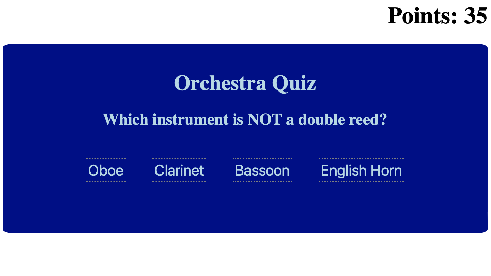

# Orchestra Quiz

This is a **multiple choice quiz** that tests your knowledge of orchestral instruments.

## Table of Contents

- [Background](#background)
- [Install](#install)
- [Usage](#usage)
- [Screenshot](#screenshot)
- [Maintainers](#maintainers)
- [Contributing](#contributing)
- [Contributors](#contributors)
- [License](#license)

## Background

*To understand more advanced concepts in Javascript,* we were instructed to create a multiple choice quiz, five questions in length. If a wrong answer is selected, time is deducted from the clock. At the end, the amount of time remaining is your score. You can then store this answer in local storage.

## Install/Link to Webpage 🔗 

Check out the link to the website:

https://dbedrossian.github.io/Mod4_Coding-Quiz/

## Usage

This is being used as an assignment project, but could easily be used in real life for any kind of multiple choice quiz.

## Screenshot

## Maintainers

[@Danny Bedrossian](https://github.com/dbedrossian).

## Contributing

Feel free to dive in! [Open an issue](https://github.com/dbedrossian/standard-readme/issues/new) or submit PRs.

## Contributors

Thanks to Youtube channel *Web Dev Simplified* for instruction on how to make the screen change colors depending on which answer is selected. Also thanks to Leif for help in office hours on multiple occasions.

## License

© Danny Bedrossian